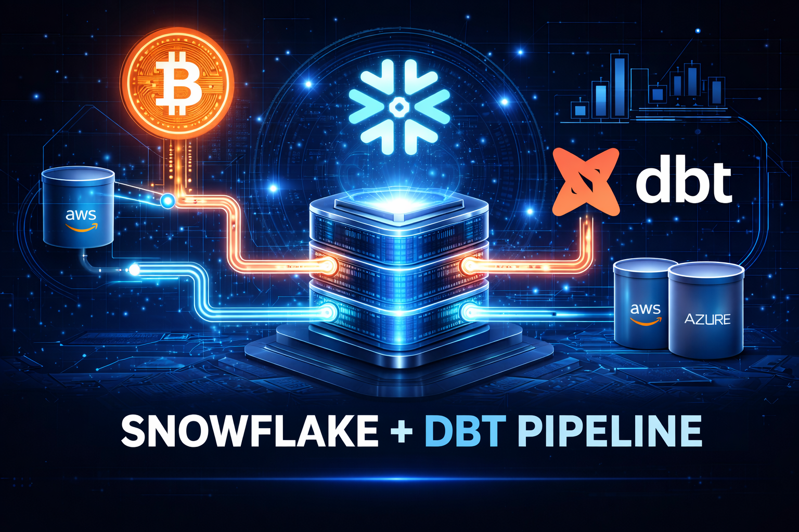
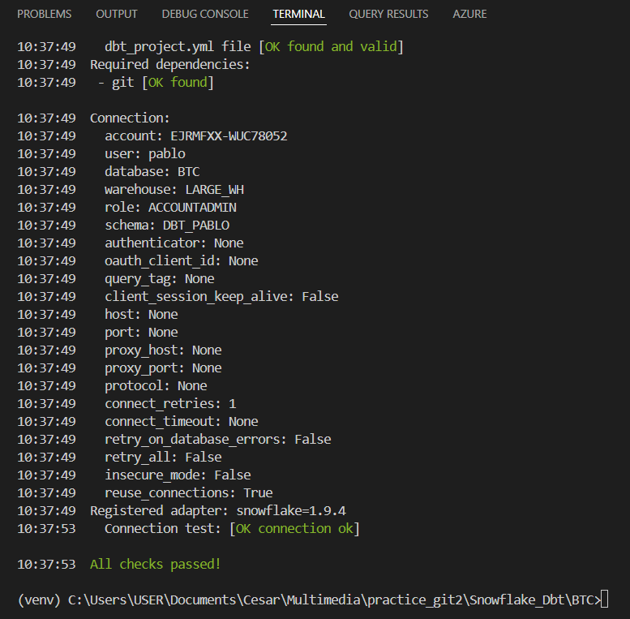
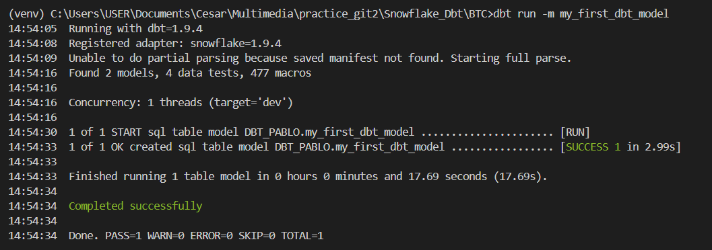
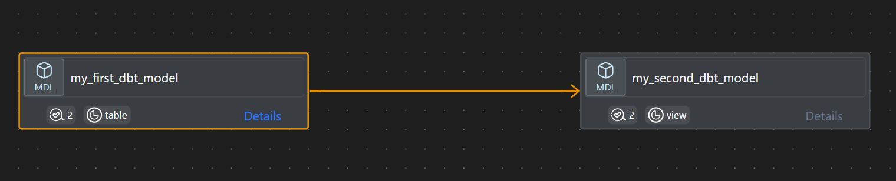
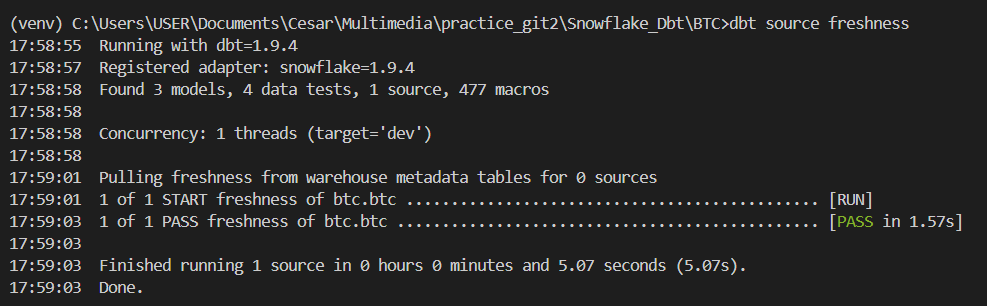
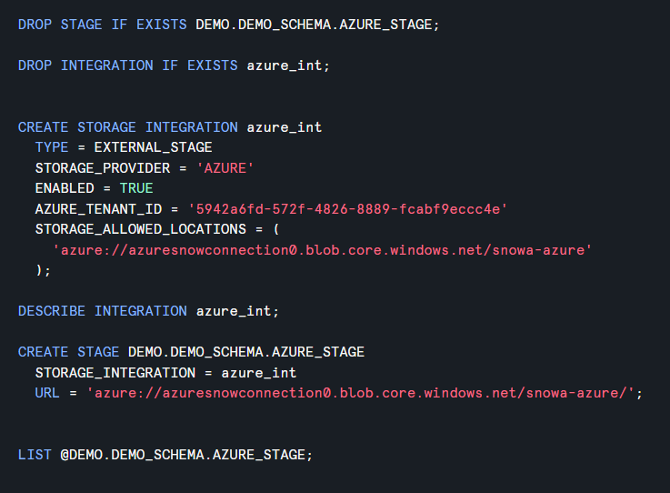
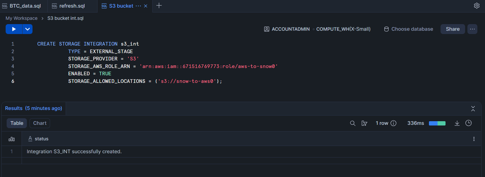

# Snowflake + dbt: Automated Bitcoin Data Loading



This project demonstrates an **automated pipeline for loading Bitcoin transaction data** using **Snowflake** and **dbt**.  

The workflow is designed to fetch data from a public Bitcoin API, transform it using **dbt models**, and store it in a **Snowflake data warehouse**. The project also integrates with **cloud container platforms** (AWS and Azure) to automate ingestion and orchestration, ensuring that the Bitcoin transaction dataset is always up-to-date for analytics and reporting.

---

## Snowflake Connection



To start, the project establishes a secure connection to a **Snowflake warehouse**:

- Credentials are stored safely using environment variables or secret managers.  
- The connection is validated using Python scripts or dbt profiles.  
- The target schema is prepared to store Bitcoin transaction data.

This ensures a stable environment for automated ETL processes.

---

## dbt Run & Transformation



Once the connection is established, **dbt** runs the transformation pipeline:

- dbt models process raw Bitcoin API data into structured tables.  
- Incremental models ensure only new or updated records are processed.  
- Transformations include cleaning, type casting, and adding derived metrics.  
- The output is stored in Snowflake tables ready for analytics dashboards or downstream applications.

> Running dbt automatically in containers (AWS/Azure) allows the pipeline to execute reliably on schedule, with minimal manual intervention.

---

## dbt Model Dependencies



The diagram above illustrates the **relationship between dbt models** in our Bitcoin data pipeline:

- **`my_first_dbt_model`** – processes raw Bitcoin API data and creates a base table.  
- **`my_second_dbt_model`** – depends on the first model and transforms the data into a view for analytics and reporting.  

Arrows indicate the **dependency flow**, ensuring that downstream transformations are automatically updated whenever the upstream model changes. This helps maintain **data integrity** and **reproducibility** across the pipeline.

---

## Snowflake SQL: Bitcoin Data Setup & Task

Below is the SQL code used to create the database, schema, stage, warehouse, table, and scheduled task to automate Bitcoin data loading:

```sql
-- Create the database and schema
CREATE DATABASE BTC;

CREATE SCHEMA BTC_SCHEMA;

-- Create an external stage pointing to the public Bitcoin S3 bucket
CREATE OR REPLACE STAGE BTC.BTC_SCHEMA.BTC_STAGE
URL='s3://aws-public-blockchain/v1.0/btc/'
FILE_FORMAT=(TYPE=PARQUET);

-- List files in the stage
LIST @BTC.BTC_SCHEMA.BTC_STAGE;

-- Create a warehouse for processing
CREATE OR REPLACE WAREHOUSE LARGE_WH
    WAREHOUSE_SIZE = 'LARGE';

-- Sample query from the stage
SELECT
    t.$1:hash AS hashkey,
    t.$1:block_hash,
    t.$1:block_number,
    t.$1:block_timestamp,
    t.$1:fee,
    t.$1:input_value,
    t.$1:output_value AS output_btc,
    ROUND(t.$1:fee / t.$1:size, 12) AS fee_per_byte,
    t.$1:is_coinbase,
    t.$1:outputs
FROM @BTC.BTC_SCHEMA.BTC_STAGE/transactions/date=2026-02-06 t;

-- Create the target table
CREATE OR REPLACE TABLE BTC.BTC_SCHEMA.BTC (
    HASH_KEY VARCHAR,
    BLOCK_HASH VARCHAR,
    BLOCK_NUMBER INT,
    BLOCK_TIMESTAMP TIMESTAMP,
    FEE FLOAT,
    INPUT_VALUE FLOAT,
    OUTPUT_VALUE FLOAT,
    FEE_PER_BYTE FLOAT,
    IS_COINBASE BOOLEAN,
    OUTPUTS VARIANT
);

-- List stage contents again
LIST @BTC.BTC_SCHEMA.BTC_STAGE;

-- Create a scheduled task to load Bitcoin data every 2 hours
CREATE OR REPLACE TASK BTC.BTC_SCHEMA.BTC_LOAD_TASK
WAREHOUSE = LARGE_WH
SCHEDULE = '2 HOUR'
AS
COPY INTO BTC.BTC_SCHEMA.BTC
FROM (
    SELECT
        t.$1:hash AS hashkey,
        t.$1:block_hash,
        t.$1:block_number,
        t.$1:block_timestamp,
        t.$1:fee,
        t.$1:input_value,
        t.$1:output_value AS output_btc,
        ROUND(t.$1:fee / t.$1:size, 12) AS fee_per_byte,
        t.$1:is_coinbase,
        t.$1:outputs
    FROM @BTC.BTC_SCHEMA.BTC_STAGE/transactions t
)
PATTERN = '.*/[0-9]{6,7}[.]snappy[.]parquet';

-- Optionally suspend the task
ALTER TASK BTC.BTC_SCHEMA.BTC_LOAD_TASK SUSPEND;
```

---




## Benefits of this Architecture

- **Automated updates:** Keeps Bitcoin data current without manual intervention.
- **Scalable:** Works seamlessly with cloud container platforms for orchestration.
- **Reliable:** The Snowflake + dbt combination ensures reproducible and version-controlled transformations.
- **Portable:** A Dockerized and containerized pipeline guarantees consistent execution across environments.
- **Team efficiency:** Automated deployment and ETL reduce manual setup time by approximately **85–90%**, allowing the team to focus on analysis and development rather than environment configuration.
